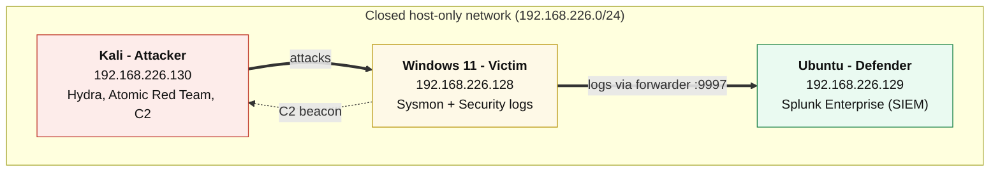

# Detection Lab: Catching Attacks in Splunk


I built a small lab where I run simulated attacks against my own machines and then catch them in Splunk. For each attack, I write a detection, document it, and map it to two common cybersecurity frameworks: the Cyber Kill Chain and MITRE ATT&CK.

This project helped me practice the basics of detection engineering: creating suspicious activity in a safe lab, collecting logs, writing searches, and explaining what I found. Every attack runs on my own VMs, on a closed network, using known tools like Hydra and Atomic Red Team. No real malware was used.

**Quick version:**
- 3 machines: a Windows victim, a Kali attacker, and an Ubuntu box running Splunk
- 4 attacks, 4 log sources, and 4 different ways to detect
- Covers the full attack: getting in, running code, staying, and phoning home
- Each one has a Splunk search and a portable Sigma rule

---

## How the lab is set up

Three VMs on a closed network with no internet during testing.

| VM | What it does | OS | Main software |
|----|------|----|---------------|
| **Victim** | The target. Makes the logs. | Windows 11 (`Advanced.lab.local`) | Sysmon (SwiftOnSecurity config), Splunk Universal Forwarder |
| **Attacker** | Runs the attacks. Also acts as the C2 server. | Kali Linux | Hydra, Atomic Red Team, Python |
| **Defender** | Collects the logs. Where I do the detection work. | Ubuntu | Splunk Enterprise |



Full machine specs, IPs, and how the network is locked down are in [lab-setup/architecture.md](lab-setup/architecture.md).

---

## The detections

Four attacks, four log sources, four different detection styles. Put together, they make one full attack from start to finish.

| # | Attack | Kill Chain | ATT&CK | Log Source | Writeup |
|---|-----------|------------|--------|------------|---------|
| 1 | RDP Brute Force | Exploitation | T1110 | Security `4625` | [link](detections/T1110-bruteforce.md) |
| 2 | Encoded PowerShell | Execution | T1059.001 | Sysmon `EID 1` | [link](detections/T1059-powershell.md) |
| 3 | Run-Key Persistence | Installation | T1547.001 | Sysmon `EID 13` | [link](detections/T1547-persistence.md) |
| 4 | C2 Beaconing | Command & Control | T1071 | Sysmon `EID 3` | [link](detections/T1071-c2.md) |

**The full attack:** the attacker guesses their way in over RDP, runs a hidden PowerShell command, sets up a registry key so they keep access, then phones home to a control server. Get in, run code, stay, phone home.

Full table: [mapping-table.md](mapping-table.md)

For the decision-making side, see [investigations/INV-rdp-bruteforce-chain.md](investigations/INV-rdp-bruteforce-chain.md), where I work through the full chain and explain the choices I made.

---

## What each one catches

- **T1110 Brute Force:** flags a spike of failed logins. I use the `4625` sub-status code to tell password guessing apart from someone just guessing usernames.
- **T1059.001 PowerShell:** finds hidden base64 PowerShell, including the short `-E` form that a basic search for `-EncodedCommand` would miss. It also flags PowerShell started by WMI.
- **T1547.001 Registry Run Key:** catches programs that set themselves to run at login, and flags the ones with suspicious file paths to cut down on installer noise.
- **T1071 C2 Beaconing:** catches a beacon by how evenly it connects, not by a known-bad address. This helps detect suspicious traffic even when the server has not been seen before.

---

## Skills shown

- Splunk search writing and log analysis
- Windows Security Event Log investigation
- Sysmon event analysis
- MITRE ATT&CK mapping
- Cyber Kill Chain mapping
- Sigma rule writing
- Brute-force, PowerShell, persistence, and C2 detection
- Basic investigation and alert review
- Basic attacker behavior simulation in a safe lab

---

## Tools and frameworks

**SIEM and logging:** Splunk Enterprise, Splunk Universal Forwarder, Sysmon (SwiftOnSecurity config)

**Attack tools:** Hydra, Atomic Red Team

**Frameworks:** MITRE ATT&CK, Cyber Kill Chain

**Output:** Splunk searches and portable Sigma rules

---

## What's in this repo

```text
Detection-Lab/
├── README.md                  this file
├── mapping-table.md           attack to framework to detection
├── detections/
│   ├── T1110-bruteforce.md
│   ├── T1059-powershell.md
│   ├── T1547-persistence.md
│   └── T1071-c2.md
├── investigations/
│   └── INV-rdp-bruteforce-chain.md
├── lab-setup/
│   ├── architecture.md        machine specs, network, topology diagram
│   └── sysmon-config-notes.md
├── sigma-rules/               portable .yml detection rules
│   ├── T1110-bruteforce.yml
│   ├── T1059-powershell.yml
│   ├── T1547-persistence.yml
│   └── T1071-c2.yml
├── diagrams/                  ATT&CK Navigator layer + Kill Chain diagram
└── screenshots/               evidence for each attack
```

---

## Safety

Everything ran on virtual machines, on a closed network with no internet during testing. All activity was performed in a private lab using simulated attacks and controlled tools. No real malware was used.

I turned off Windows Defender on the victim in the lab only so it would not block the test. In a real setup, you would tune exclusions instead of turning off antivirus.

---

## Author

**Beck (Sarvarbek)**
