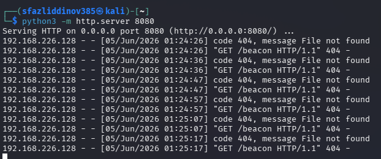
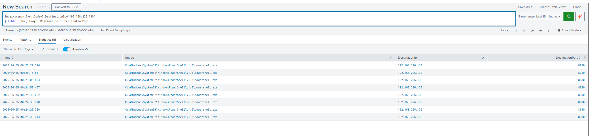
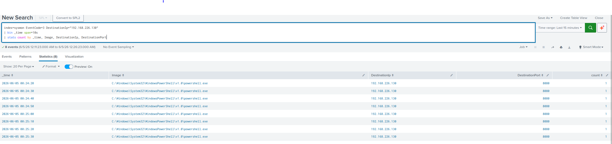
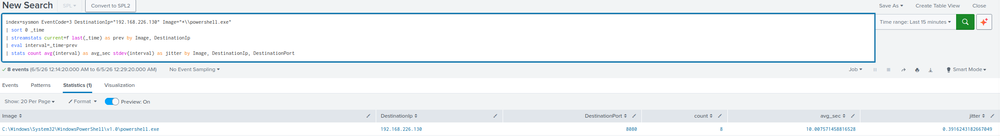

# T1071: Command & Control (Beaconing)

**Kill Chain phase:** Command & Control. **ATT&CK:** [T1071: Application Layer Protocol](https://attack.mitre.org/techniques/T1071/) (Command and Control)
**Log source:** Sysmon, EventCode `3` (Network Connection)

---

## Summary

A simulated implant on the victim called back to a control server at a regular interval, the behavior known as beaconing. Sysmon recorded each outbound connection as an EventCode 3 (network connection) event and forwarded it to Splunk. The detection does not key on the destination alone. It keys on the regular timing of the connections (low jitter), which is the signature of automated C2 traffic. This is the first detection in the lab built on Sysmon network telemetry, a fourth log source, and the most behavior based of the four.

---

## Lab setup

| Role | Host | IP |
|------|------|----|
| Victim / Endpoint (implant) | `Advanced.lab.local` | `192.168.226.128` |
| Attacker / C2 server | Kali Linux | `192.168.226.130` |
| Defender / SIEM | Ubuntu (Splunk Enterprise) | `192.168.226.129` |

Because the lab is closed, there is no real external C2. Kali serves as the C2 server, and the victim beacons to it. This reproduces the call-home pattern entirely inside the closed network.

---

## 1. Running the attack

A listener was started on Kali to act as the C2 server:
```bash
python3 -m http.server 8080
```

A beacon loop was run on the victim, simulating an implant calling home every 10 seconds:
```powershell
while ($true) {
  try { Invoke-WebRequest -Uri "http://192.168.226.130:8080/beacon" -UseBasicParsing -TimeoutSec 5 | Out-Null } catch {}
  Start-Sleep -Seconds 10
}
```


*The Kali listener (acting as the C2 server) receives a callback from the victim (192.168.226.128) every 10 seconds. The 404 responses are expected, since there is no /beacon file. The regular 10-second spacing is the beaconing pattern seen from the C2 side.*

---

## 2. Telemetry produced

Each beacon created a Sysmon EventCode 3 event:

```
EventCode=3                   (Network Connection)
Image:           C:\Windows\System32\WindowsPowerShell\v1.0\powershell.exe
DestinationIp:   192.168.226.130
DestinationPort: 8080
ComputerName:    Advanced.lab.local
```

---

## 3. Detection (SPL)

### Connection list (confirm the callbacks)

```spl
index=sysmon EventCode=3 DestinationIp="192.168.226.130"
| table _time, Image, DestinationIp, DestinationPort
```


*Splunk shows 8 outbound connections from powershell.exe to 192.168.226.130 on port 8080. The timestamps are roughly 10 seconds apart, matching the beacon loop.*

### Periodicity view (group connections into time buckets)

```spl
index=sysmon EventCode=3 DestinationIp="192.168.226.130"
| bin _time span=10s
| stats count by _time, Image, DestinationIp, DestinationPort
```


*Binning the connections into 10-second buckets shows exactly one connection per bucket. This steady, machine-like cadence is something normal user traffic does not produce.*

### Beaconing detection (the real signal is the timing)

```spl
index=sysmon EventCode=3 DestinationIp="192.168.226.130" Image="*\\powershell.exe"
| sort 0 _time
| streamstats current=f last(_time) as prev by Image, DestinationIp
| eval interval=_time-prev
| stats count avg(interval) as avg_sec stdev(interval) as jitter by Image, DestinationIp, DestinationPort
```


*The detection measures the time between connections. The result: 8 connections, an average interval of about 10.01 seconds, and a jitter (standard deviation) of about 0.39 seconds. That very low jitter is the proof. People and most legitimate apps connect at irregular times; only automated software calls home this evenly.*

A production alert would add a threshold on the count and the jitter:
```spl
| where count >= 5 AND jitter < 2
```

This is behavior based detection. It identifies the pattern of the traffic rather than a known-bad indicator, so it can catch a beacon to a destination that has never been seen before.

---

## 4. False positives and tuning

| Case | Why it beacons | Tuning |
|------|----------------|--------|
| Software update checks | Periodic polling | Allow-list known update servers. They usually poll on minutes or hours, not seconds |
| Telemetry or keep-alives | Regular heartbeats | Allow-list the destination. Raise the interval and count thresholds |
| Monitoring agents | Fixed check-in interval | Allow-list the agent process and destination |

Legitimate periodic traffic does exist, but it usually goes to known-good destinations, on longer intervals, or with more irregular timing. Tuning involves baselining known destinations and alerting on regular, low-jitter beacons to unknown hosts.

---

## 5. Framework mapping

| Framework | Mapping |
|-----------|---------|
| Lockheed Martin Cyber Kill Chain | **Command & Control**: the implant calling back for instructions |
| MITRE ATT&CK | **T1071: Application Layer Protocol** (Tactic: Command and Control) |

---

## 6. Sigma rule

```yaml
title: Possible C2 Beaconing - Low-Jitter Periodic Connections
id: 8c4f2a17-9d63-4b85-a1e0-c2beacon1071
status: experimental
description: Detects a process making many network connections to one destination at
  an almost constant interval (low jitter), which indicates automated command-and-control
  beaconing. Best implemented as a scheduled search.
references:
  - https://attack.mitre.org/techniques/T1071/
author: Beck
logsource:
  product: windows
  category: network_connection
detection:
  selection:
    EventID: 3
  # The count plus low timing jitter per source and destination is evaluated in
  # the scheduled SIEM search. See the SPL above.
  condition: selection
fields:
  - Image
  - DestinationIp
  - DestinationPort
falsepositives:
  - Software update checks, telemetry, and monitoring agents (allow-list known destinations)
level: medium
tags:
  - attack.command_and_control
  - attack.t1071
```