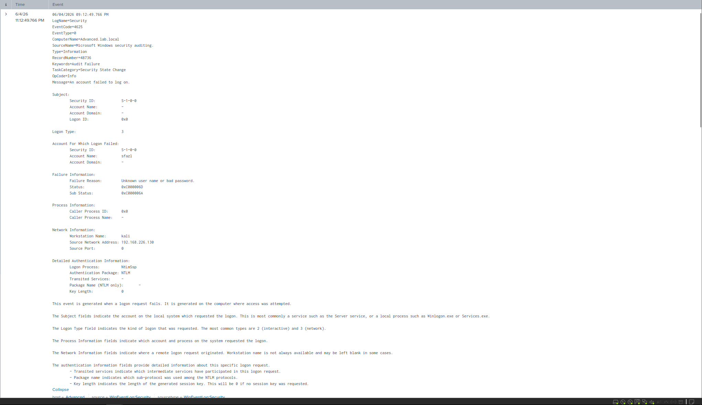
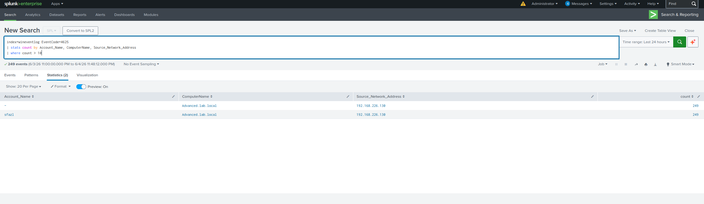
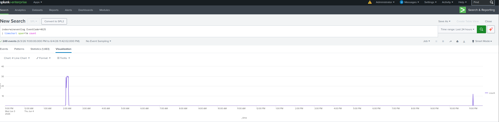

# T1110: Brute Force (RDP)

**Kill Chain phase:** Exploitation. **ATT&CK:** [T1110: Brute Force](https://attack.mitre.org/techniques/T1110/) (Credential Access)
**Log source:** Windows Security Log, EventCode `4625` (Audit Failure)

---

## Summary

An attacker on the closed lab network guessed passwords against a real account on the victim over RDP. The repeated failed logins produced a burst of Windows Security `4625` events. Those events were forwarded to Splunk, where the burst was detected with an SPL query. This is the classic brute-force signature: many failed logins, one account, one source, and a short time window.

---

## Lab setup

| Role | Host | IP |
|------|------|----|
| Attacker | Kali Linux (`kali`) | `192.168.226.130` |
| Victim / Endpoint | `Advanced.lab.local` | `192.168.226.128` |
| Defender / SIEM | Ubuntu (Splunk Enterprise) | `192.168.226.129` |

All three VMs are on a closed host-only network with no internet. No live malware was used. The attack is a known password-guessing tool (Hydra) run against an account on an owned VM.

---

## 1. Running the attack

RDP was enabled on the victim. It is built into Windows, so no installation was required:

```powershell
# On the victim (admin PowerShell)
Set-ItemProperty -Path 'HKLM:\System\CurrentControlSet\Control\Terminal Server' -Name "fDenyTSConnections" -Value 0
Enable-NetFirewallRule -DisplayGroup "Remote Desktop"
# reboot so the RDP service binds the 3389 listener
netstat -an | findstr :3389   # confirm 0.0.0.0:3389 LISTENING
```

The brute force was launched from Kali against the local account `sfazl`:

```bash
nc -zv 192.168.226.128 3389   # confirm the port is reachable
hydra -l sfazl -P /usr/share/wordlists/rockyou.txt rdp://192.168.226.128 -t 1
```

`-t 1` (one attempt at a time) is used because the RDP module is sensitive to parallel connections. The goal is to generate failed logins, not to crack the password.

---

## 2. Telemetry produced

Each failed attempt created one Security `4625` event on the victim.


*Raw 4625 event. The attacker's source IP (192.168.226.130), computer name (kali), the targeted account (sfazl), and the failure sub-status (0xC000006A) are all captured.*

The fields that matter most for this detection:

- **Sub Status `0xC000006A`** means the username is valid and the password is wrong. This is more significant than `0xC0000064` (the user does not exist), because it shows the attacker has already found a real account and is now guessing its password. Many `0xC000006A` events against one account indicate a password brute force. Many `0xC0000064` events across many names indicate username enumeration.
- **Workstation Name `kali`** is the attacker's own computer name, which leaked into the login attempt and provides an attribution clue.
- **Logon Type 3 plus NTLM** shows that RDP performed a network login over NTLM. There is no Kerberos because the victim is not domain joined.

---

## 3. Detection (SPL)

### Hunt query (confirm the activity)

```spl
index=wineventlog EventCode=4625
| stats count by Account_Name, ComputerName, Source_Network_Address
| where count > 10
```


*The hunt query groups failed logins by account and source. The result is a single source (192.168.226.130) responsible for 249 failed logins against sfazl, which is the brute-force signature.*

### Alert query (time bucketed and enriched)

```spl
index=wineventlog EventCode=4625
| bin _time span=5m
| stats count AS failed_logons
        values(Sub_Status) AS sub_status
        values(Workstation_Name) AS src_host
        by _time, Account_Name, Source_Network_Address
| where failed_logons > 10
```

The 5-minute window turns a one-time hunt into a recurring alert. Surfacing `Sub_Status` and `Workstation_Name` gives the responding analyst the failure type and the attacker's computer name in a single row.

### Timeline view (the burst over time)

```spl
index=wineventlog EventCode=4625
| timechart span=1m count
```


*The timeline shows a flat baseline of zero failed logins across the day, then a sharp spike during the attack. A sudden burst against a quiet baseline is exactly how a brute force appears to an analyst.*

---

## 4. False positives and tuning

| Case | Why it fires | Tuning |
|------|--------------|--------|
| Locked-out service account | Expired credentials retrying automatically | Allow-list known service accounts |
| Misconfigured app or script | A hard-coded old password in a loop | Allow-list the source host or IP |
| User after a password change | Old saved password on a phone or RDP client | The threshold plus the short window filters most of these out |

A single mistyped password will not cross 10 failures in 5 minutes, so the threshold is conservative against normal noise.

---

## 5. Framework mapping

| Framework | Mapping |
|-----------|---------|
| Lockheed Martin Cyber Kill Chain | **Exploitation**: attempting to gain access by guessing a password |
| MITRE ATT&CK | **T1110: Brute Force** (Tactic: Credential Access) |
| Sub-technique (RDP/network) | T1110.001: Password Guessing |

---

## 6. Sigma rule

```yaml
title: RDP/Network Brute Force - Failed Logon Spike
id: 9f1c0e2a-1b3d-4c6e-8a90-bruteforce4625
status: experimental
description: Detects many Windows failed logons (4625) from one source against one
  account in a short window, indicating a brute force attack.
references:
  - https://attack.mitre.org/techniques/T1110/
author: Beck
logsource:
  product: windows
  service: security
detection:
  selection:
    EventID: 4625
  timeframe: 5m
  condition: selection | count() by SubjectUserName, IpAddress > 10
fields:
  - TargetUserName
  - IpAddress
  - WorkstationName
  - SubStatus
falsepositives:
  - Locked-out or misconfigured service accounts
  - Applications retrying old credentials
level: high
tags:
  - attack.credential_access
  - attack.t1110
```