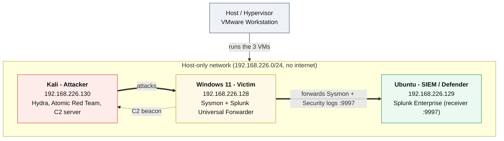

# Detection Lab - Architecture

## Purpose

A small, self-contained lab for generating attack telemetry, collecting it in a SIEM, and validating detection rules (Sigma and SPL) against the resulting logs.

## Topology

## Components

| Role | Host | IP | Key Software |
|----------------|----------------|------------------|--------------------------------------|
| Victim / Endpoint | Windows 11 | 192.168.226.128 | Sysmon (SwiftOnSecurity config), Splunk Universal Forwarder |
| SIEM / Collector | Ubuntu | 192.168.226.129 | Splunk Enterprise, Sigma rules |
| Attacker | Kali Linux | 192.168.226.130 | Hydra, Atomic Red Team, Python (acts as C2 server) |

This lab has no domain controller. The victim is a standalone, non-domain-joined Windows 11 host, so authentication is local (NTLM over RDP) rather than Kerberos.

## Data Flow

1. The attacker runs a technique (T1110, T1059.001, T1547.001, or T1071) from Kali against the Windows victim. Hydra drives the brute force, Atomic Red Team runs the execution and persistence tests, and a Python `http.server` plus a PowerShell loop simulate the C2 beacon.
2. Sysmon and the Windows Security log on the victim record the activity: process creation, registry changes, network connections, and logon attempts.
3. The Splunk Universal Forwarder ships those logs to Splunk Enterprise on the Ubuntu box over port 9997.
4. Splunk searches (SPL) and the Sigma rules run against the indexed data to detect each technique.
5. Findings and screenshots are saved under `screenshots/`.

## Logging Coverage

- Authentication: Windows Security `4624` (success) and `4625` (failure)
- Process creation with full command line: Sysmon `EID 1`
- Registry value changes: Sysmon `EID 13`
- Network connections: Sysmon `EID 3`

The SwiftOnSecurity Sysmon config also captures other event types (such as DNS queries via `EID 22`) that are available for future detections.

Note: PowerShell here is detected through the command line captured in Sysmon `EID 1`, not through Script Block Logging (`4104`). Enabling Script Block Logging and Process Creation auditing (`4688`) would be a solid next addition to this lab.

## Mapped Techniques

| Technique | Name | Rule file |
|-----------|---------------------------------------|-----------------------------------|
| T1110 | Brute Force | ../sigma-rules/T1110-bruteforce.yml |
| T1059.001 | PowerShell | ../sigma-rules/T1059-powershell.yml |
| T1547.001 | Registry Run Keys / Startup Folder | ../sigma-rules/T1547-persistence.yml |
| T1071 | Application Layer Protocol (C2) | ../sigma-rules/T1071-c2.yml |

See [sysmon-config-notes.md](sysmon-config-notes.md) for the Sysmon configuration used.
